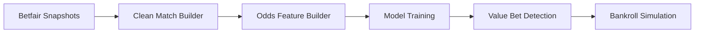

# 🎾 Tennis Value Betting Model (P1v2)

This project builds and evaluates a data-driven **value betting model** for ATP and WTA tennis tournaments using:

- 📊 Betfair Exchange **snapshot data** (LTP odds)
- 📁 Jeff Sackmann’s **match results**
- 🤖 Logistic regression models to detect value bets
- 💸 Bankroll simulation with customizable strategies

---

## 🔁 Core Workflow Overview



---

## 🛠 Key Components

| Folder          | Purpose                                                                 |
|-----------------|-------------------------------------------------------------------------|
| `scripts/pipeline/` | Core pipeline: features → train → predict → value → simulate        |
| `scripts/builders/` | Builds match datasets (e.g. AO, FO, IW), joins results               |
| `scripts/debug/`    | Tools to analyze expected value bins, LTP coverage, misalignments    |
| `scripts/archive/`  | Deprecated or superseded scripts (for reference only)                |
| `scripts/tools/`    | PowerShell utilities for cleaning and organizing the project         |
| `data/`             | Raw and processed match/csv data                                     |
| `modeling/`         | Trained models, bankroll logs, and value bet outputs                 |
| `parsed/`           | Intermediate files like snapshots, clean matches, form lookups       |

---

## ▶️ One-Off Pipeline Steps

You can run individual pipeline stages with:

```bash
python scripts/pipeline/build_odds_features.py ...
python scripts/pipeline/train_win_model_from_odds.py ...
python scripts/pipeline/detect_value_bets.py ...
python scripts/pipeline/simulate_bankroll_growth.py ...
```

---

## 🔁 Typical Workflow (Example)

1. Parse snapshot files (optional)
2. Build clean matches from snapshot-only markets
3. Generate odds-based features
4. Train model or evaluate on holdout Slam
5. Detect value bets and simulate bankroll

---

## ✅ Project Status

- [x] AO + FO + WB + USO ATP modeling
- [x] Indian Wells ATP snapshot alignment
- [x] Bankroll simulation framework in place
- [ ] Miami and WTA support upcoming
- [ ] Player stats and Elo integration planned

---

## 📂 Setup

Install dependencies:

```bash
python -m venv .venv
.venv\Scripts\activate
pip install -r requirements.txt
```

---

Let me know if you’d like a one-command launcher (e.g. `run_pipeline.py`) for automating a full tournament cycle.
